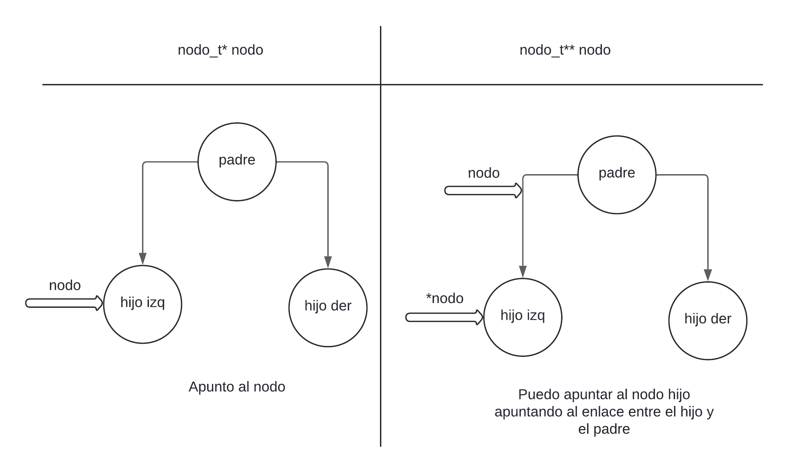
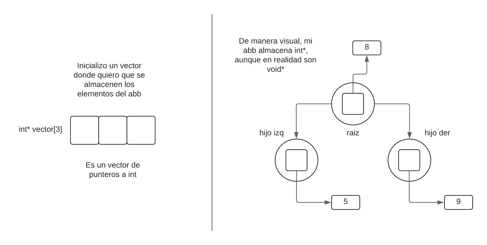

<div align="right">

</div>

# TDA ABB

## Alumno: Juan Ernesto Juarez Lezama - 110418 - jjuarez@gmail.com

- Para compilar:

```bash
gcc -g tp_abb.c src/abb.c src/csv.c src/split.c -o tp_abb
```

- Para ejecutar:

```bash
./tp_abb pokedex.csv
```

- Para ejecutar con valgrind:
```bash
valgrind ./tp_abb pokedex.csv
```

---

##  Funcionamiento

Explicación de cómo funcionan las estructuras desarrolladas en el TP y el funcionamiento general del mismo.

Aclarar en esta parte todas las decisiones que se tomaron al realizar el TP, cosas que no se aclaren en el enunciado, fragmentos de código que necesiten explicación extra, etc.

Incluír **EN TODOS LOS TPS** los diagramas relevantes al problema (mayormente diagramas de memoria para explicar las estructuras, pero se pueden utilizar otros diagramas si es necesario).

### Por ejemplo:

El programa funciona abriendo el archivo pasado como parámetro y leyendolo línea por línea. Por cada línea crea un registro e intenta agregarlo al vector. La función de lectura intenta leer todo el archivo o hasta encontrar el primer error. Devuelve un vector con todos los registros creados.

<div align="center">

</div>

En el archivo `sarasa.c` la función `funcion1` utiliza `realloc` para agrandar la zona de memoria utilizada para conquistar el mundo. El resultado de `realloc` lo guardo en una variable auxiliar para no perder el puntero original en caso de error:

```c
int *vector = realloc(vector_original, (n+1)*sizeof(int));

if(vector == NULL)
    return -1;
vector_original = vector;
```


<div align="center">

</div>

---

## Respuestas a las preguntas teóricas

-   Explique teóricamente (y utilizando gráficos) qué es una árbol, árbol
    binario y árbol binario de búsqueda. Explique cómo funcionan, cuáles son sus
    operaciones básicas (incluyendo el análisis de complejidad de cada una de
    ellas) y por qué es importante la distinción de cada uno de estos diferentes
    tipos de árboles. Ayúdese con diagramas para explicar.

### Operaciones básicas: insertar, obtener y eliminar

## Árbol

## Arbol Binario

## Árbol Binario de Busqueda

## ¿Por qué es importante la distintición entre estos tipos de árboles?

-   Explique la implementación de ABB realizada y las decisiones de diseño
    tomadas (por ejemplo, si tal o cuál funciones fue planteada de forma
    recursiva, iterativa o mixta y por qué, que dificultades encontró al manejar
    los nodos y punteros, reservar y liberar memoria, etc).

## Diseño
Cómo ya sabemos, en nuestra implementación usaremos 2 estructuras: `abb_t` es la estructura principal de nuestro TDA y `nodo_t` que es la estructura de cada nodo que guardará información

```c
	typedef struct nodo {
		void *elemento;
		struct nodo *izq;
		struct nodo *der;
	} nodo_t;

	typedef struct abb {
		size_t nodos;
		nodo_t *raiz;
		int (*comparador)(void*, void*);
	}abb_t;
```

Tanto para las funciones de insertar, obtener y quitar, vamos a tener una función en común, que es la función de buscar un nodo. Al ser un Árbol Binario de Busqueda, vamos a tener que hacer comparaciones para llegar a un nodo, o llegar a ninguno (si es que tal elemento no se encuentra en el abb). Para esto, usé una función recursiva.
```c
	nodo_t **buscar_nodo(abb_t* abb, nodo_t** nodo_actual, void* elemento)
	{
		if (!*nodo_actual || abb->comparador(elemento, (*nodo_actual)->elemento) == 0) {
			return nodo_actual;
		} else if (abb->comparador(elemento, (*nodo_actual)->elemento) < 0) {
			return buscar_nodo(abb, &(*nodo_actual)->izq, elemento);
		} else {
			return buscar_nodo(abb, &(*nodo_actual)->der, elemento);
		}
	}
```
Cómo se puede ver, la función retorna un `nodo_t**`, pero, ¿por qué doble puntero y no uno solo? Bueno, la respuesta es para optimizar código. La explicación es la siguiente: Si nosotros hacemos una función que retorne un `nodo_t*`, significa que estamos retornando un puntero a nodo, o sea, la dirección de memoria del nodo, cosa que está bien, si buscamos un nodo que contenga un elemento `x`, entonces una función que retorna `nodo_t*` hace ese trabajo, pero qué pasa con esto, para la función `obtener` viene de maravilla, porque si se encuentra, retorna el nodo, si no, retorna `NULL` En la función de `insertar`, sucede algo casi parecido pero con modificaciones, pero la idea principal para usar esté codigo es cuando queremos `quitar` un elemento, porque aparte de encontrar el nodo, debemos buscar el padre de ese nodo, y como nuestro abb solo tiene una dirección, no podemos saber quién es su padre, y tendriamos que volver a iterar hasta un nodo antes, entonces, primero intenté solucionar el mayor problema y con esa solución, solucionar las otras más pequeñas y es por eso que usé una función que retorne `nodo_t**`, porque gracias a esto, no necesito buscar el nodo padre, ya que yo estoy dentro del nodo padre, y tengo la dirección de memoria del puntero que apunta al hijo, por ende, tengo la dirección de memoria de mi hijo estando dentro del padre sin apuntar al padre.

<div align="center">

</div>

Con este movimiento, no tengo que estar dando más `if`, porque puede darse el caso de que elimine un nodo raiz, entonces se debe hacer verificaciones extras, pero con mi implementación, ya maneja esos casos internamente. Un ejemplo: Si quiero eliminar el único nodo que tiene un abb, sería la raiz, entonces, si elimino usando una función que retorna `nodo_t*`, cuando verifique que el nodo es una hoja, aparte de eso, debe verificar si es una raiz o no, en cambio, como yo uso retorno un `nodo_t**`, observar que yo le paso la direccióñ de memoria de la raiz.  

```c
    nodo_t **puntero_entre_padre_e_hijo = buscar_nodo(abb, &(abb->raiz), buscado);
```

Cuando entra en la función de busqueda, y el elemento que busca, es el mismo que la raíz, retorna lo mismo que ingresé (la dirección de memoria de la raíz), entonces cuando entra en la función de `borrar_nodo_hoja`, significa que está haciendo un `raiz = NULL`, y así es como reduje verificaciones extras.

## Recorridos:
-Preorden  
-Inorden  
-Postorden  

Me centraré en un solo recorrido, ya que toda la lógica de funcionamiento se repite para los otros 2 recorridos (exceptuando las posiciones de qué nodo visita primero).  

En este caso, me centraré en el recorrido postorden, es el recorrido que una vez que visite al hijo izquierdo y al hijo derecho, se puede recién visitar a sí mismo. El código es el siguiente:

```c
	bool recorrido_postorden(nodo_t *nodo_actual, bool (*f)(void *, void *),
				void *ctx, size_t *contador, size_t tope)
	{
		if (!nodo_actual)
			return true;
		if (!recorrido_postorden(nodo_actual->izq, f, ctx, contador, tope) ||
			!recorrido_postorden(nodo_actual->der, f, ctx, contador, tope))
			return false;
		if (*contador == tope || !f(nodo_actual->elemento, ctx))
			return false;
		(*contador)++;
		return true;
	}
```

Si bien la función `abb_iterar_postorden` debe retornar un `size_t`, la función recurisiva hubiese podido ser una función que también retorne un `size_t`, pero decidí que mejor sea una función boleana. Lo que gano con esto, es verificar el estado actual de mi hijo, si su resultado fue un `true` o un `false`. Si alguno dio `false`, entonces es como decir: "Bueno, mi hijo me tiró false, entonces no puedo visitarme a mí mismo, también retorno false", entonces es un efecto en cadena de `return false`. Con esto gano que, al ser una función recursiva booleada, la función me tire un estado, dependiendo de ese estado, significa que en algún punto de la iteración dio `false`, entonces retorno el `contador+1`, pero si la función dio true, significa que iteró todo sin problemas, entonces, puedo decir con certeca que retorno la cantidad de elementos en el abb: `abb->nodos`.

```c
	size_t cantidad_iterados = 0;
	return !recorrido_postorden(abb->raiz, f, ctx, &cantidad_iterados, abb->nodos) ? cantidad_iterados+1 : abb->nodos;
```

Terminamos con el recorrido y verificaciones para la función iterativa, pero, podemos observar que hay un parametro más en nuestra función, que es: `size_t tope`. La razón de esto es porque quiero reutilizar esta misma función recursiva de iteración en `abb_vectorizar_postorden` (misma lógica para los otros recorridos). Podemos ver que ambas funciones hacen algo similiar, que es recorrer el arbol, con la diferencia de que en `abb_iterar_postorden` debemos mandar una función que haga algo con cada elemento, pero en la función `abb_vectorizar_postorden`, debe poner cada elemento en cada posición del vector, hasta alcanzar todo el tamaño que nos dan, entonces de ahí viene el porqué de ese parametro, con eso ganamos que cuando llegue a esa posicion (el contador), salga de la función.
```c
	if (*contador == tope || !f(nodo_actual->elemento, ctx))
		return false;
```

Ahora bien, aquí viene otra razón de por qué también reutilizé la función recursiva, y es que, en vez de crear otra función auxiliar que ponga cada elemento en dicho vector, mejor reutilizar el parametro `bool (*f)(void *, void *), void *ctx`: Lo que hago es, darle la dirección de memoria del vector en `ctx`, y una función que haga algo con ese vector em `f`.

```c
	bool asignar_elementos_en_vector(void *elemento, void *vector)
	{
		void ***puntero_a_vector = (void ***)vector;
		**puntero_a_vector = elemento;
		(*puntero_a_vector)++;
		return true;
	}
```

Lo que hace esta función, mejor dicho, la variable `puntero_a_vector` es tener la dirección del bloque en cada momento de la iteración, pudiendo así asignarle valores a cada bloque y poder moverme al siguiente bloque. Para entender todo eso, preferí explicar como se comportan los punteros desde cuando creo el vector, hasta donde doy valores.

1) Inicializarmos el vector (para esto ya debemos tener el abb con sus respectivos elementos).

<div align="center">

</div>

2) Entender cómo funciona el parametro `void** vector` en `abb_vectorizar_postorden`.

<div align="center">

</div>

3) El porqué mandamos `&vector` en la función recursivdad `recorrido_postorden`.

4) Como se maneja los punteros en la función `asignar_elementos_en_vector`.