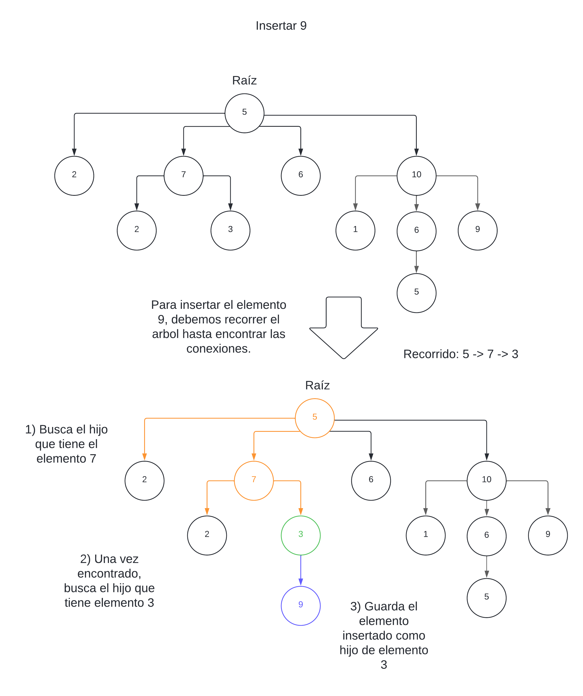
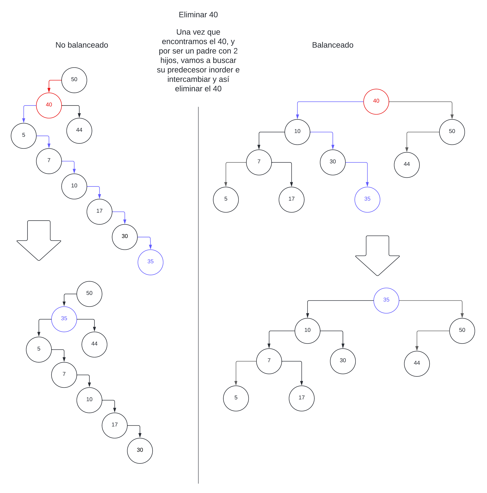

<div align="right">

</div>

# TDA ABB

## Alumno: Juan Ernesto Juarez Lezama - 110418 - jjuarez@gmail.com

- Para compilar:

```bash
gcc -g tp_abb.c src/abb.c src/csv.c src/split.c -o tp_abb
```

- Para ejecutar:

```bash
./tp_abb pokedex.csv
```

- Para ejecutar con valgrind:
```bash
valgrind ./tp_abb pokedex.csv
```

---

##  Funcionamiento

Se creó un programa que lee un archivo `.csv` y guarda todos los elementos en un Árbol Binario de Busqueda.  
Así quedaría el Stack y Heap usando un ABB para ordenar Pokemones, usando `pokedex.csv`.

<div align="center">

</div>

---

## Respuestas a las preguntas teóricas

-   Explique teóricamente (y utilizando gráficos) qué es una árbol, árbol
    binario y árbol binario de búsqueda. Explique cómo funcionan, cuáles son sus
    operaciones básicas (incluyendo el análisis de complejidad de cada una de
    ellas) y por qué es importante la distinción de cada uno de estos diferentes
    tipos de árboles. Ayúdese con diagramas para explicar.

### Operaciones básicas: insertar, obtener y eliminar

## Árbol
También conocido como Árbol N-ario, este árbol tiene la propiedad de que puede tener `n` hijos. Puede ser 2, 3, 4, 5 ... No hay limites para la cantidad de hijos que puede tener cada padre, y no sabe qué cosa es menor o mayor.
Mi criterio de ordenamiento será un recorrido por conocimiento, o sea, saber donde se debe posicionar\buscar\eliminar. Lo que conlleva a hacerlo dináimo.

Insertar: En el peor de los casos, tendrémos que insertar el elemento más abajo y a la derecha, lo que significa recorrer todo el árbol, esto es `O(n)`.

<div align="center">

</div>

Obtener: Se buscará todos los nodos hijos de cada padre, siguiendo el orden establecido por el usuario donde desea buscar algún elemento, donde puede existir o no el elemento. Esto es `O(n)`.

<div align="center">

</div>

Eliminar: Con la misma lógica, marcaremos el recorrido, pasando por todos los nodos anteriores a este, hasta llegar al elemento que deseamos eliminar `O(n)`.

<div align="center">

</div>

## Arbol Binario
A diferencia del Árbol N-ario, este árbol tiene la distinción de que como máximo, cada padre puede tener cómo máximo 2 hijos, pero tampoco conoce qué es menor o mayor.  
Mi criterio de ordenamiento será un recorrido por niveles.

Insertar: Insertamos en el primer hijo que se encuentre vacío, esto es `O(n)`, ya que debemos recorrer todo el á®bol para encontrarlo.

<div align="center">

</div>

Obtener: La misma idea, al ser un recorrido por niveles, debemos recorrer hasta encontrarlo `O(n)`.

<div align="center">

</div>

Eliminar: Debemos recorrer nodo por nodo hasta toparnos con el elemento, `O(n)`.

<div align="center">

</div>


## Árbol Binario de Busqueda
Árbol Binario de Busqueda, tendrá la distinción de qué cosa es menor, igual o mayor. Como convención, lo menor irá a la izquierda, y lo mayor a la derecha.
Tendré 2 criterios de ordenamiento: no Balanceado y Balanceado.

`Insertar en abb no Balanceado`: El peor de los casos es que se inserte de tal manera que parezca una lista, entonces será `O(n)`.
`Insertar en abb Balanceado`: Al tener un manejo de como acomodar las ramas para que haya un orden con mejor optimización, al ser que vamos a movernos por rama, o sea, siempre elegir una de dos opciones hasta llegar a nuestro elemento (en el no balanceado, no podríamos elegir entre 2 caminos, ya que si parece una lista, hay solo un recorrido, 1 sola opción), eso es un O(log(n)).

<div align="center">

</div>

`Insertar en abb no Balanceado`: Al igual que insertar, el hecho de que puede quedar como una lista, y que busquemos el nodo del extremo, esta función se convierte en `O(n)`.
`Insertar en abb Balanceado: Buscará moviendose entre las ramas (2 opciones), por ende es `O(log(n))`.

<div align="center">

</div>

`Eliminar en abb no Balanceado`: Misma lógica, el peor caso es que borre el nodo del extremo, o también borrar un nodo con 2 hijos y que el nodo de su predecor inorden esté lejos, esto es `O(n)`.
`Eliminar en abb Balanceado`; Suponiendo que queremos eliminar un nodo que tiene 2 hijos, al buscar el elemento predecesor, no va a recorrer 'todo el abb', ya que el arbol está rapetido de tal manera que esté todo balacandea, esto es `O(log(n))`.

<div align="center">

</div>

## ¿Por qué es importante la distintición entre estos tipos de árboles?
Cada tipo de Árbol ataca un problema en específico. Como sabemos, un Árbol Binario de Busqueda, al tener un funcionamiento comparativo, sirve para ordenar elementos con eficiencia. Un Árbol Binario no existe la comparación de qué es mayor o menor, en nuestra explicación que dimos más arriba, decidimos que sea un recorrido por niveles, pero no necesariamente es la única, por ejemplo un Árbol Binario serviría para operaciones matemáticas, ya que si tienes 4 + 5 + 2, es lo mismo que primero hacer 4 + 5 (subarbol) y luego ese resultado sumarle 2, y así recorrimos el árbol. Por último, el Árbol General o N-ario, en la manera que mostré, es como si fuese un directorio donde se guardaman archivos. Entonces, cada Árbol tiene un porpósito diferente y depende de eso, qué nos conviene mejor usar.

-   Explique la implementación de ABB realizada y las decisiones de diseño
    tomadas (por ejemplo, si tal o cuál funciones fue planteada de forma
    recursiva, iterativa o mixta y por qué, que dificultades encontró al manejar
    los nodos y punteros, reservar y liberar memoria, etc).

## Diseño
Cómo ya sabemos, en nuestra implementación usaremos 2 estructuras: `abb_t` es la estructura principal de nuestro TDA y `nodo_t` que es la estructura de cada nodo que guardará información

```c
	typedef struct nodo {
		void *elemento;
		struct nodo *izq;
		struct nodo *der;
	} nodo_t;

	typedef struct abb {
		size_t nodos;
		nodo_t *raiz;
		int (*comparador)(void*, void*);
	}abb_t;
```

Tanto para las funciones de insertar, obtener y quitar, vamos a tener una función en común, que es la función de buscar un nodo. Al ser un Árbol Binario de Busqueda, vamos a tener que hacer comparaciones para llegar a un nodo, o llegar a ninguno (si es que tal elemento no se encuentra en el abb). Para esto, usé una función recursiva.
```c
	nodo_t **buscar_nodo(abb_t* abb, nodo_t** nodo_actual, void* elemento)
	{
		if (!*nodo_actual || abb->comparador(elemento, (*nodo_actual)->elemento) == 0) {
			return nodo_actual;
		} else if (abb->comparador(elemento, (*nodo_actual)->elemento) < 0) {
			return buscar_nodo(abb, &(*nodo_actual)->izq, elemento);
		} else {
			return buscar_nodo(abb, &(*nodo_actual)->der, elemento);
		}
	}
```
Cómo se puede ver, la función retorna un `nodo_t**`, pero, ¿por qué doble puntero y no uno solo (nodo_t*)? Bueno, la respuesta es para optimizar código. La explicación es la siguiente: Si nosotros hacemos una función que retorne un `nodo_t*`, significa que estamos retornando un puntero a nodo, o sea, la dirección de memoria del nodo, cosa que está bien, si buscamos un nodo que contenga un elemento `x`, entonces una función que retorna `nodo_t*` hace ese trabajo, pero qué pasa con esto, para la función `obtener` viene de maravilla, porque si se encuentra, retorna el nodo, si no, retorna `NULL`. En la función de `insertar`, sucede algo similar pero con modificaciones, ya que si hay repetidos o no, pero la idea principal para usar esté codigo es cuando queremos `quitar` un elemento, porque aparte de encontrar el nodo, debemos buscar el padre de ese nodo, y como nuestro abb solo tiene una dirección, no podemos saber quién es su padre, y tendriamos que volver a iterar hasta un nodo antes, entonces, primero intenté solucionar el mayor problema y con esa solución, solucionar las otras más pequeñas y es por eso que usé una función que retorne `nodo_t**`, porque gracias a esto, no necesito buscar el nodo padre, ya que yo estoy dentro del nodo padre, y tengo la dirección de memoria del puntero que apunta al hijo, por ende, tengo la dirección de memoria de mi hijo estando dentro del padre sin apuntar al padre.

<div align="center">

</div>

Para entender un poco mejor esto, tengo otra función que retorna `nodo_t**`, y es buscar el predecesor inorden, porque cuando elimino un nodo con 2 hijos, debo buscar su reemplazo. A esta función le pasamos como parametro el hijo izquierdo del nodo a eliminar, y buscará recursivamente el nodo que está más a la derecha (el reemplazo).

```c
nodo_t **buscar_predecesor_inorden(nodo_t **nodo_actual)
{
	if (!(*nodo_actual) || !(*nodo_actual)->der) {
		return nodo_actual;
	}
	return buscar_predecesor_inorden(&((*nodo_actual)->der));
}
```
<div align="center">

</div>

<div align="center">

</div>

Mencionar que, al liberar el nodo, liberamos el nodo donde se encuentra el elemento a eliminar, y con eso, solo necesito un `free()` en la función de `quitar_abb`. Existe otra manera, que sería encotrar un padre con 2 hijos, e intercambia elementos (no los nodos) con el predecesor inorden, lo cuál es bueno, ya que en ese caso, se covierte en eliminar solo el nodo precesor que sería un nodo con 1 hijo o una hoja, pero decidí mejor hacer 3 funciones por separado, para demostrar el dominio de los punteros y sabiendo qué estoy haciendo.

```c
	nodo_t **puntero_entre_padre_e_hijo = buscar_nodo(abb, &(abb->raiz), buscado);
	if (!*puntero_entre_padre_e_hijo)
		return false;
	nodo_t *nodo_guardado = (*puntero_entre_padre_e_hijo);
	if (!(*puntero_entre_padre_e_hijo)->izq && !(*puntero_entre_padre_e_hijo)->der)
		borrar_nodo_hoja(abb, puntero_entre_padre_e_hijo);
	else if ((*puntero_entre_padre_e_hijo)->izq && (*puntero_entre_padre_e_hijo)->der)
		borrar_nodo_con_hijos(abb, puntero_entre_padre_e_hijo);
	else
		borrar_nodo_con_un_hijo(abb, puntero_entre_padre_e_hijo);
	if (encontrado)
		*encontrado = nodo_guardado->elemento;
	free(nodo_guardado);
```

Con este movimiento, no tengo que estar dando más `if`, porque puede darse el caso de que elimine un nodo raiz, entonces se debe hacer verificaciones extras, pero con mi implementación, ya maneja esos casos internamente. Un ejemplo: Si quiero eliminar el único nodo que tiene un abb, sería la raiz, entonces, si elimino usando una función que retorna `nodo_t*`, cuando verifique que el nodo es una hoja, aparte de eso, debe verificar si es una raiz o no, en cambio, con mi implementación no hay esa verificación `nodo_t**`, por que al pasarle la dirección de memoria de `abb->raiz`, estoy apuntando al enlace que se crea entre la estructura `abb_t` y el nodo raiz del abb.

<div align="center">

</div>

## Recorridos:
-Preorden  
-Inorden  
-Postorden  

Me centraré en un solo recorrido, ya que toda la lógica de funcionamiento se repite para los otros 2 recorridos (exceptuando las posiciones de qué nodo visita primero).  

En este caso, me centraré en el recorrido postorden, es el recorrido que una vez que visite al hijo izquierdo y al hijo derecho, se puede visitar a sí mismo.

También explicar que creeé una estructura llamada `información_t`, que tendrá 3 parametros: una variale `tope`, almacena la cantidad de nodos que debemos visitar (como máximo), una variable `iteracion`, que vendría a ser la posición en la que el elemento visitado está actualmente con respecto a su recorrido, y un doble puntero a vector, que de eso hablarémos luego.

```c
	typedef struct informacion {
		void** vector;
		size_t iteracion;
		size_t tope;
	} informacion_t;
```

Si bien la función `abb_iterar_postorden` debe retornar un `size_t`, la función recurisiva hubiese podido ser una función que también retorne un `size_t`, pero decidí que mejor sea una función boleana. Lo que gano con esto, es verificar el estado actual de mi hijo, si su resultado fue un `true` o un `false`. Si alguno dio `false`, entonces es como decir: `"Bueno, mi hijo me tiró false, entonces no puedo visitarme a mí mismo, también retorno false"`, entonces es un efecto en cadena de `return false`. 

```c
	bool recorrido_postorden(nodo_t *nodo_actual, bool (*f)(void *, void *),
				void *ctx, informacion_t* informacion)
	{
		if (!nodo_actual)
			return true;
		if (!recorrido_postorden(nodo_actual->izq, f, ctx, informacion) ||
			!recorrido_postorden(nodo_actual->der, f, ctx, informacion))
			return false;
		if (informacion->iteracion == informacion->tope || !f(nodo_actual->elemento, ctx))
			return false;
		informacion->iteracion++;
		return true;
	}
```

Con esto gano que, al ser una función recursiva booleada, la función me tire un estado, dependiendo de ese estado, significa que en algún punto de la iteración dio `false`, entonces retorno el en qué iteración cortó pero si la función dio true, significa que iteró todo sin problemas, entonces, puedo decir con certeca que retorno la cantidad de elementos en el abb: `abb->nodos`. Ya que `informacion` es una función que solo se usará cuando entre a dicha función, directamente hago que sea una variable que vive en el stack y no necesitaría pedirle memoria al heap.

```c
	size_t abb_iterar_postorden(abb_t *abb, bool (*f)(void *, void *), void *ctx)
	{
		if (!abb)
			return 0;
		informacion_t informacion = {.vector = NULL, .iteracion = 0, .tope = abb->nodos};
		return !recorrido_postorden(abb->raiz, f, ctx, &informacion) ? informacion.iteracion + 1 : abb->nodos;
	}
```

Hablando un poco más sobre mi estructura `informacion_t`, nos ayudará a poder aumentar en 1 cada vez que visitamos un elemento, y aunque halla una condición de corte a la izquierda, pero dicho corte, en nuestra iteración, no tiene efecto, pero para la siguiente función del abb, sí.

```c
	if (informacion->iteracion == informacion->tope || !f(nodo_actual->elemento, ctx))
		return false;
	informacion->iteracion++;
```

La siguiente función para hablar, es la función `abb_vectorizar_postorden`. Primero había pensando en que sea un triple puntero al vector y que cada vez que iteramos el arbol, vaya avanzando al siguiente bloque de memoria para almacenar los elementos, pero hay problema, cuando hacemos esto, cuando llegamos al final, tiene que avanzar, y no hay manera de hacer eso sin complejizar tanto el código, por eso decidí directamente crear la estructura `informacion_t`, que almacena el vector que le pasamos.

```c
	informacion_t informarcion_posiciones = {.vector = vector, .iteracion = 0, .tope = tamaño};
	return !recorrido_postorden(abb->raiz, asignar_elementos_en_vector, 
					&informarcion_posiciones, &informarcion_posiciones) ? informarcion_posiciones.iteracion : abb->nodos;
```

Como podemos observar, le asignamos el puntero al vector en nuestra estructura, y un tope, que será el tamaño del vector.
Para esto, también mencionar que se puede apreciar que asignamos 2 veces `&informarcion_posiciones` a la función recursiva, y esto es para que, la estructura `informacion_t` pueda tomarse en cada momento de la iteración con el elemento, si tenemos el vector y tenemos la posición, solo debemos asignarle el elemento, y creando la función `asignar_elementos_en_vector`, emos achicado el problema de la iteración y la vectorización.

```c
	bool asignar_elementos_en_vector(void *elemento, void *vector)
	{	
		((informacion_t*)vector)->vector[((informacion_t*)vector)->iteracion] = elemento;
		return true;
	}
```

Con esto, en la dicho vector, en tal posición, se almacenará el elemento en el que el recorrido se encuentre en ese momento.
Volviendo al código del corte, hay 2 cortes:

```c
	if (informacion->iteracion == informacion->tope || !f(nodo_actual->elemento, ctx))
		return false;
	informacion->iteracion++;
```

¿Qué pasa aquí? Una vez que hallamos llegado al tope del vector, si es verdadero el lado izquierda, ya no entrará a la parte izquierda, ya que al ser un `or`, con verificar que la primera condición sea verdadera, es suficiente, ya que `or` tiene la propiedad de si alguna de las 2 es cierto, le es suficiente para que todo sea verdad, por eso cuando vamos iteración nodo por nodo, la condicón de la izquierda no se cumple, por eso entra a la condición de la derecha, como ambas no cumplen, no entra en la parte de `return false`, por ende, sigue iterando y aumentando la posición.

## Complejidades Algorirmicas de cada función:
Con todo lo mencionado, para nuestra implementación de ABB, podemos dar las complejidades algoritmicas de cada función.

`abb_crear`: `O(1)`  
`abb_insertar`: `O(n)`  
`abb_quitar`: `O(n)`  
`abb_obtener`: `O(n)`  
`abb_cantidad`: `O(1)`  
`abb_destruir`: `O(n)`, ya que liberará cada nodo que tenga el ABB.  
`abb_destruir_todo`: `O(n * f(g))`, siendo `f(g)` el elemento que tenga el nodo a eliminar, quizás es un ABB de Listas, entonces debemos liberar cada lista, que guardan `m` elementos.  
`Funciones de iteración`: `O(n * f(g))`, siendo `f(g)` dependiendo qué tipo de esructura es el elemento guardado, quizás una lista y la función es sumar todos lo elementos de cada lista según la iteración.  
`Funciones de Vectorización`: `O(n + m)`, debemos tener en cuenta que, aunque tengamos un tamaño `m` del vector, el máximo de elementos que vamos a poner, será la cantidad de elementos en el abb, osea, si tenemos un vector de 100 bloques, pero nuestro ABB tiene solo 5 elementos, solo se iterará y vectorizará esos 5 elementos, por ende, la funciones de vectorizar quedan en `O(n)`.